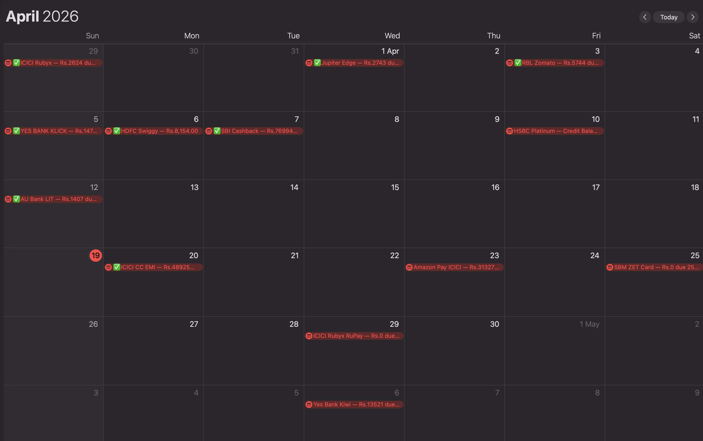
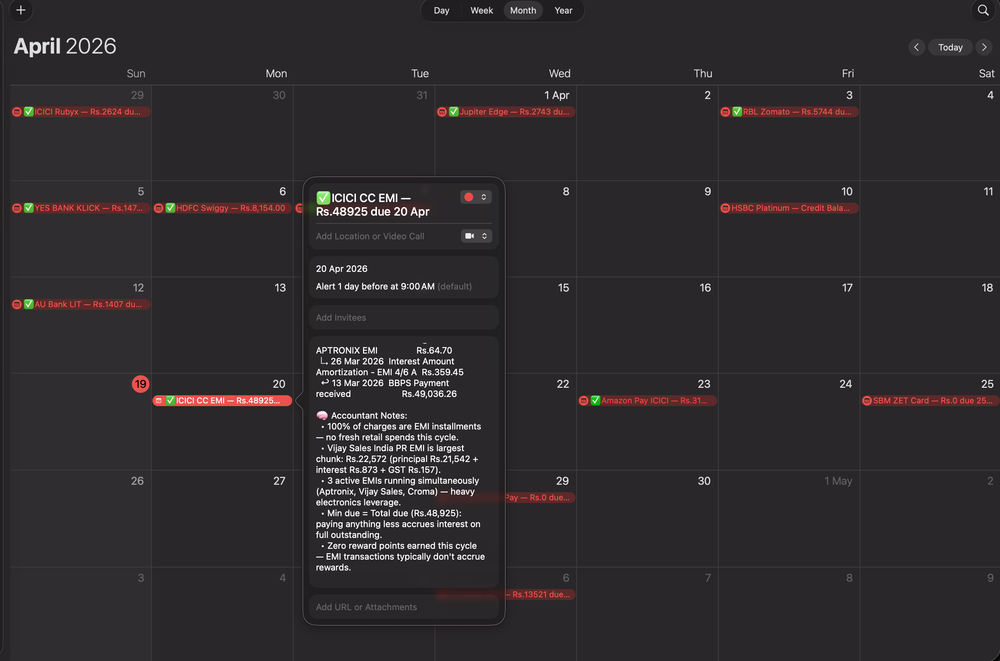
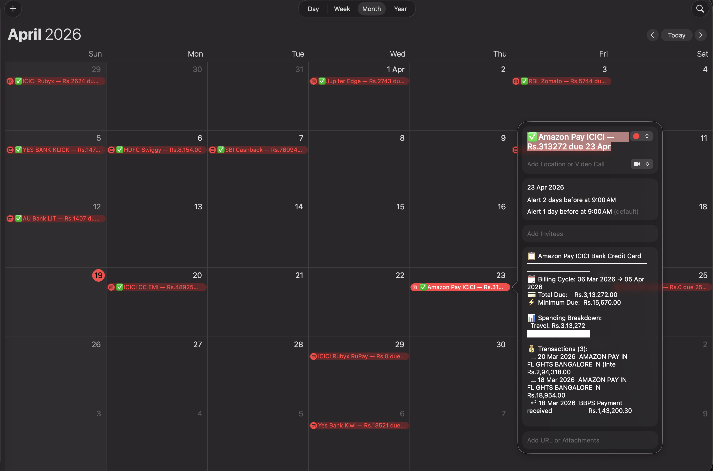

<div align="center">

# synccc

**Automate every credit card statement. Zero manual work.**

*Fetches PDFs from Gmail → Decrypts → Parses with AI → Creates rich calendar events with full transaction breakdowns*

[](LICENSE)
[](docker-compose.yml)
[](services/core)

</div>

---

## What is this?

If you have multiple credit cards across multiple email accounts, you know the pain — opening PDFs, checking due dates, missing payments.

**synccc** automates the entire pipeline:

1. **Fetches** CC statement PDFs from any number of Gmail accounts via IMAP
2. **Decrypts** password-protected PDFs (qpdf + pikepdf)
3. **Deduplicates** by SHA256 content hash — safe to run daily, nothing gets double-processed
4. **Parses** with AI — extracts due date, total amount, every transaction, and category breakdown
5. **Creates calendar events** on the due date with the full expense breakdown in the description — 7d/3d/1d reminders included
6. Optionally **uploads to Paperless-NGX** for long-term document storage

> Add it once. Never open a CC PDF manually again.

---

## Demo

<div align="center">







</div>

---

## Features

- **Any number of Gmail accounts** — add as many as you need
- **Any number of cards** — map each card to a Gmail account with sender/subject filters
- **Two cards from the same sender** — use `filter_subject` + `filter_subject_exclude` to distinguish them
- **AI provider of your choice** — Gemini, Anthropic (Claude), or OpenAI — swap via one config line
- **Calendar of your choice** — iCloud (CalDAV) today, Google Calendar coming soon
- **Storage of your choice** — Paperless-NGX or local folder + Apache Tika for OCR
- **Rich calendar events** — due date, billing cycle, category spend breakdown, every transaction listed
- **Content hash dedup** — same PDF from two email addresses only processed once
- **Runs on a cron schedule** — configurable, default 8 AM daily

---

## Quick Start

### Prerequisites
- [Docker](https://docs.docker.com/get-docker/) + Docker Compose
- Gmail with [2-Step Verification](https://myaccount.google.com/security) enabled
- An API key from [Gemini](https://aistudio.google.com/app/apikey) (free tier available), [Anthropic](https://console.anthropic.com/), or [OpenAI](https://platform.openai.com/api-keys)

### 1. Clone

```bash
git clone https://github.com/nav-ios/synccc.git
cd synccc
```

### 2. Configure

```bash
cp config.example.yaml config.yaml
```

Edit `config.yaml` — add your Gmail accounts, cards, AI key, and calendar credentials. See the full reference below.

### 3. Run

```bash
docker compose up -d
```

synccc starts and runs on your configured schedule (default: 8 AM daily).

**Trigger a run immediately:**
```bash
docker compose exec core node src/main.js --run-now
```

**Watch logs:**
```bash
docker compose logs -f core
```

---

## Configuration

Everything lives in a single `config.yaml`. Here's a real-world example:

```yaml
schedule:
  cron: "0 8 * * *"           # daily at 8 AM

accounts:
  - id: 1
    email: you@gmail.com
    app_password: "xxxx xxxx xxxx xxxx"
  - id: 2
    email: other@gmail.com
    app_password: "xxxx xxxx xxxx xxxx"

cards:
  - name: "HDFC Swiggy"
    account_id: 1
    filter_from: "hdfcbank"
    filter_subject: "Swiggy"
    since: "2024-01-01"
    passwords:
      - "YOURPDFPASSWORD"

  # Two cards from the same sender — use filter_subject_exclude
  - name: "ICICI Amazon Pay"
    account_id: 2
    filter_from: "credit_cards@icicibank.com"
    filter_subject: "Amazon Pay ICICI"
    since: "2024-01-01"
    passwords: []

  - name: "ICICI Coral"
    account_id: 2
    filter_from: "credit_cards@icicibank.com"
    filter_subject: "ICICI Bank Credit Card Statement"
    filter_subject_exclude: "Amazon Pay"    # skip Amazon Pay emails
    since: "2024-01-01"
    passwords: []

ai:
  provider: gemini             # gemini | anthropic | openai
  gemini_api_key: "AIza..."
  gemini_model: "gemini-2.0-flash"

storage:
  provider: local              # local | paperless
  local:
    path: "./data/statements"

calendar:
  provider: icaldav            # icaldav | none
  icaldav:
    user: "you@icloud.com"
    password: "xxxx-xxxx-xxxx-xxxx"
    calendar_name: "Credit Cards"
```

See [`config.example.yaml`](config.example.yaml) for the full reference with all options and comments.

---

## What the Calendar Events Look Like

Each event is created on the payment due date with this in the description:

```
📋 HDFC Swiggy Credit Card
─────────────────────────────
🗓 Billing Cycle: 01 Mar 2025 → 31 Mar 2025
💳 Total Due:   Rs.12,450.00
⚡ Minimum Due: Rs.1,245.00

📊 Spending Breakdown:
  Food & Dining: Rs.5,200  ██████████
  Shopping: Rs.4,100       ███████
  Travel: Rs.2,000         ████
  Fuel: Rs.1,150           ██

💰 Transactions (24):
  ↳ 28 Mar  Swiggy                              Rs.340.00
  ↳ 25 Mar  Amazon                              Rs.1,299.00
  ↳ 22 Mar  IRCTC                               Rs.2,000.00
  ...

🧠 Insights:
  • Food & Dining is your top category at Rs.5,200 (42% of spend)
  • Single large transaction: IRCTC Rs.2,000 on 22 Mar
  • Spend up 18% vs last month — driven by travel
```

With **7-day, 3-day, and 1-day reminders** so you never miss a payment.

---

## Setup Guides

### Gmail App Password

1. Enable [2-Step Verification](https://myaccount.google.com/security) on your Google account
2. Go to [myaccount.google.com/apppasswords](https://myaccount.google.com/apppasswords)
3. Create a password named `synccc`
4. Paste it into `config.yaml` under `accounts[].app_password`

### iCloud App-Specific Password

1. Go to [appleid.apple.com](https://appleid.apple.com) → Sign-In and Security → App-Specific Passwords
2. Generate a password named `synccc`
3. Paste it into `config.yaml` under `calendar.icaldav.password`

### Google Calendar

**Step 1 — Create OAuth2 credentials**

1. Go to [Google Cloud Console](https://console.cloud.google.com/) → Create a new project
2. Enable the **Google Calendar API** (APIs & Services → Enable APIs → search "Google Calendar API")
3. Go to APIs & Services → Credentials → Create Credentials → **OAuth 2.0 Client ID**
4. Application type: **Desktop app** — name it `synccc`
5. Download the JSON file and save it as `google_credentials.json` in the synccc root folder

**Step 2 — Update config.yaml**

```yaml
calendar:
  provider: google
  google:
    credentials_file: "./google_credentials.json"
    calendar_id: "primary"     # or a specific calendar ID
```

**Step 3 — One-time auth (run once only)**

```bash
docker compose run --rm core node src/auth-google.js
```

This prints a URL — open it in your browser, sign in, grant access, paste the code back. Token is saved to `./data/google_token.json` and synccc runs headlessly from that point on. No browser needed again.

### Paperless-NGX (optional)

For long-term storage and searchable statements:

```yaml
storage:
  provider: paperless
  paperless:
    url: "http://your-paperless-host:8000"
    token: "your-api-token"     # Settings → API → Generate token
```

---

## Architecture

```
synccc/
├── docker-compose.yml         # spin up everything with one command
├── config.example.yaml        # copy to config.yaml and fill in
├── data/                      # state.json + local PDFs (gitignored)
└── services/
    ├── decryptor/             # Python — qpdf + pikepdf PDF decryption
    └── core/                  # Node.js — main orchestrator
        └── src/
            ├── main.js        # scheduler + --run-now entry point
            ├── pipeline.js    # per-card pipeline with SHA256 dedup
            ├── imap.js        # Gmail IMAP attachment fetcher
            ├── ai.js          # Gemini / Anthropic / OpenAI parser
            ├── config.js      # config loader + validator
            ├── calendar/
            │   ├── icaldav.js # iCloud CalDAV event creation
            │   └── google.js  # Google Calendar (coming soon)
            └── storage/
                ├── paperless.js   # Paperless-NGX upload + OCR fetch
                └── local.js       # local folder + Apache Tika OCR
```

State is stored in `./data/state.json` — a list of SHA256 hashes of processed PDFs. Delete it to reprocess everything from scratch.

---

## FAQ

**Will this work with banks outside India?**
Yes. The AI parser handles any bank format — just set the correct `filter_from` and `filter_subject` for your bank's emails.

**Is my data safe?**
Your PDFs stay on your machine. Only extracted OCR text (no account numbers — banks mask those) is sent to the AI API.

**Can I run this without Docker?**
Yes. Run the decryptor with `python services/decryptor/main.py` and the core with `node services/core/src/main.js`. Requires `qpdf` installed locally.

**What if the AI gets the due date wrong?**
synccc logs the failure and skips creating an event. Check `docker compose logs core` to see which cards need attention.

**How do I add more cards later?**
Add them to `config.yaml` and restart: `docker compose restart core`. New cards are picked up on the next run.

---

## Roadmap

- [x] Google Calendar support
- [ ] Outlook / non-Gmail IMAP
- [ ] Push notifications (ntfy.sh / Pushover)
- [ ] Web dashboard for spend overview

---

## Contributing

PRs welcome. Best places to start:

- **Non-Gmail IMAP** — extend `services/core/src/imap.js`
- **New AI providers** — add a case in `services/core/src/ai.js`
- **Push notifications** — add ntfy.sh / Pushover support in `services/core/src/pipeline.js`

Please open an issue before starting a large change.

---

## License

MIT — do whatever you want with it.

---

<div align="center">

Built out of frustration with 14 credit cards and too many missed payments.

**If this saved you time, drop a ⭐**

</div>
